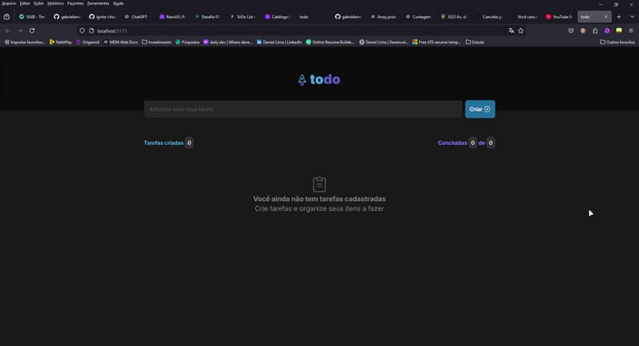

# 🚀 Aplicação em React com TypeScript

Este projeto foi desenvolvido como parte do desafio prático da trilha de ReactJS da Rocketseat. A aplicação tem como objetivo consolidar conhecimentos fundamentais do ecossistema React, com foco em componentização, propriedades, estados e uso adequado de keys.
## 📚 Conceitos Aplicados
* Componentização: Organização do código em componentes reutilizáveis e modulares.
* Estados: Gerenciamento de estados internos para manipular e refletir mudanças na interface.
* Propriedades (Props): Passagem de dados entre componentes, facilitando a reutilização.
* Modules: Estilização modular com CSS Modules para evitar conflitos de estilos entre componentes.
* Keys: Utilização correta das keys para otimizar a renderização de listas e evitar problemas com o DOM virtual.

## 🛠️ Tecnologias Utilizadas
* **ReactJS:** Biblioteca principal para construção de interfaces.
* **TypeScript:** Tipagem estática para maior segurança e legibilidade do código.
* **CSS:** Estilização básica da aplicação.
* **CSS Modules:** Modularização de estilos para componentes isolados.
* **Vite: (Opcional)** Ambiente de desenvolvimento rápido, se aplicável.

## 🚀 Como Executar o Projeto
Clone este repositório:

```bash
git clone https://github.com/gabrielamenezes/todo-list.git
```
Instale as dependências:
```js
npm install
//ou
yarn install
```

Inicie o servidor de desenvolvimento:
```js
npm run dev
//ou
yarn dev
```
Acesse no navegador:


## Autor

 <br />
 <b>Gabriela Menezes</b></a>


Feito com ❤️ por Gabriela Menezes 👋🏽 Entre em contato!

[](https://www.linkedin.com/in/gabimenezesdev/) 
[](mailto:gabimenezess)
